# MANUAL - HOJA DE TRABAJO 1
#### Laboratorio de Redes de Computadoras 1 - Sección A
---------

La hoja de trabajo 1 tiene como propósito aplicar el protocolo VTP (VLAN Trunking Protocol) en una red de switches, utilizando Packet Tracer para llevar a cabo una simulación, donde se configurarán diferentes modos de operación y se verificará la propagación de VLANs en un entorno de red jerárquico.

### COMANDOS PARA CONFIGURACIÓN DE SWITCHES

###### SWITCH SERVIDOR
```
enable
configure terminal
hostname servidor
vtp version 2
vtp domain 202010003
vtp password 202010003
vtp mode server
vlan 13
name ADMON
exit
vlan 23
name MERCA
exit
vlan 33
name VENTAS
exit
interface FastEthernet0/1
switchport mode trunk
switchport trunk allowed vlan 13,23,33
exit
write memory
exit
```

###### SWITCH TRANSPARENTE
```
enable
configure terminal
hostname transparente
vtp version 2
vtp domain 202010003
vtp password 202010003
vtp mode transparent
interface FastEthernet0/1
switchport mode trunk
switchport trunk allowed vlan 13,23,33
exit
interface FastEthernet0/5
switchport mode trunk
switchport trunk allowed vlan 13,23,33
exit
interface FastEthernet0/6
switchport mode trunk
switchport trunk allowed vlan 13,23,33
exit
write memory
exit
```

###### SWITCH CLIENTE01
```
enable
configure terminal
hostname cliente01
vtp version 2
vtp domain 202010003
vtp password 202010003
vtp mode client
interface FastEthernet0/1
switchport mode trunk
switchport trunk allowed vlan 13,23,33
exit
interface FastEthernet0/5
switchport mode trunk
switchport trunk allowed vlan 13,23,33
exit
interface FastEthernet0/10
switchport mode access
switchport access vlan 13
exit
interface FastEthernet0/11
switchport mode access
switchport access vlan 23
exit
interface FastEthernet0/12
switchport mode access
switchport access vlan 33
exit
write memory
exit
```

###### SWITCH CLIENTE02
```
enable
configure terminal
hostname cliente02
vtp version 2
vtp domain 202010003
vtp password 202010003
vtp mode client
interface FastEthernet0/1
switchport mode trunk
switchport trunk allowed vlan 13,23,33
exit
interface FastEthernet0/6
switchport mode trunk
switchport trunk allowed vlan 13,23,33
exit
interface FastEthernet0/10
switchport mode access
switchport access vlan 13
exit
interface FastEthernet0/11
switchport mode access
switchport access vlan 23
exit
interface FastEthernet0/12
switchport mode access
switchport access vlan 33
exit
write memory
exit
```

### PROTOCOLO VTP EN SWITCHES

###### SWITCH SERVIDOR
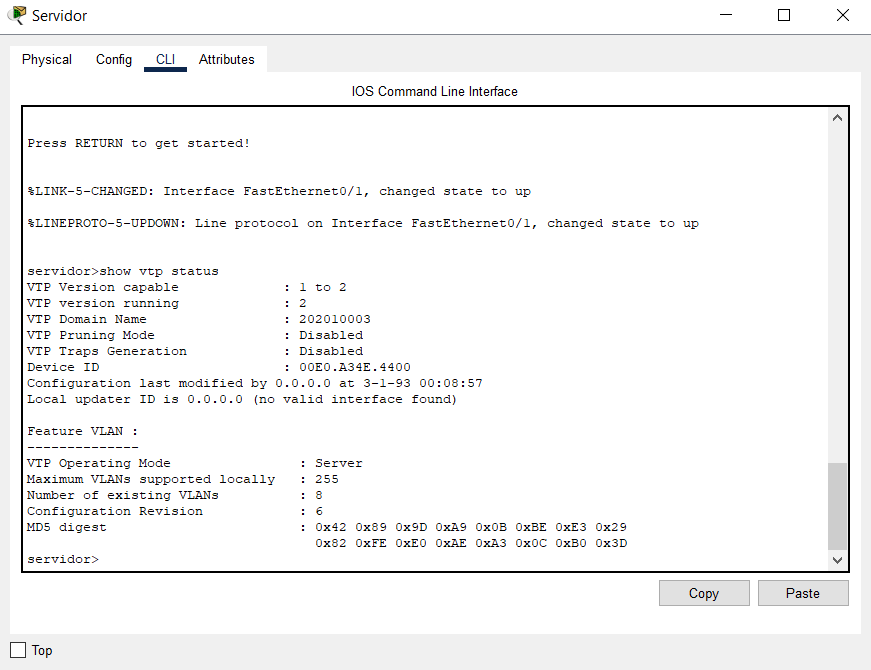

###### SWITCH TRANSPARENTE
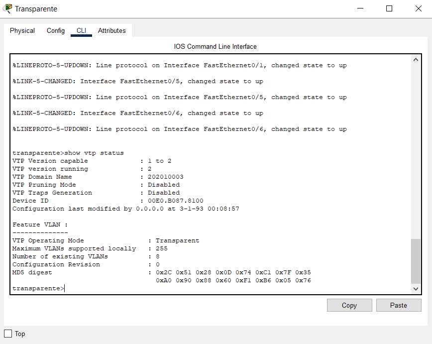

###### SWITCH CLIENTE01
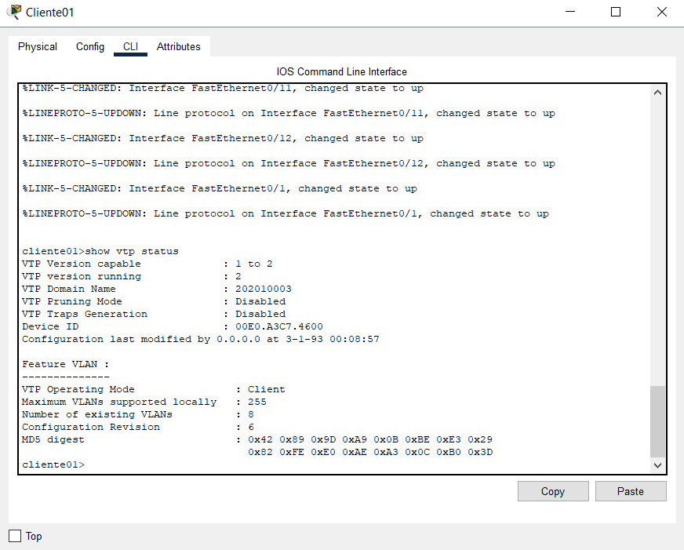

###### SWITCH CLIENTE02
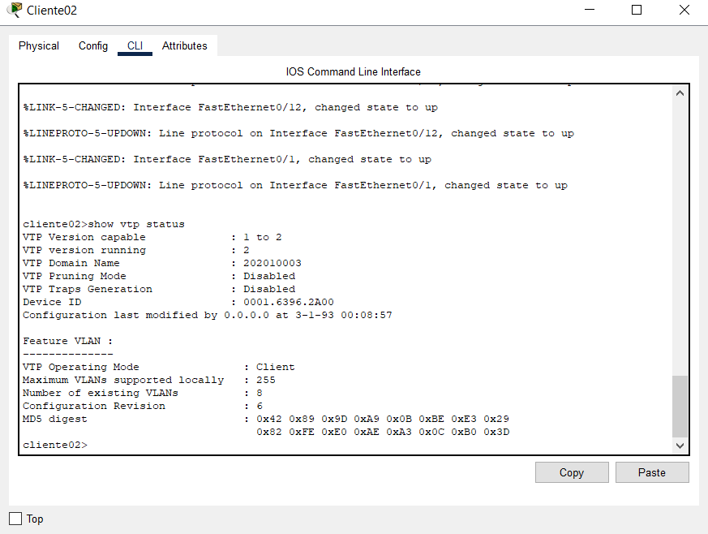

### VLANS EN SWITCHES

###### SWITCH SERVIDOR
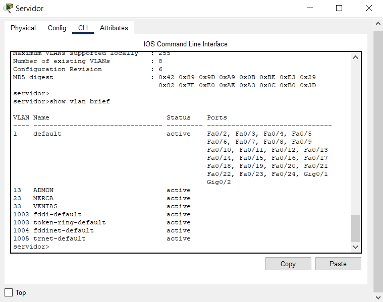

###### SWITCH TRANSPARENTE
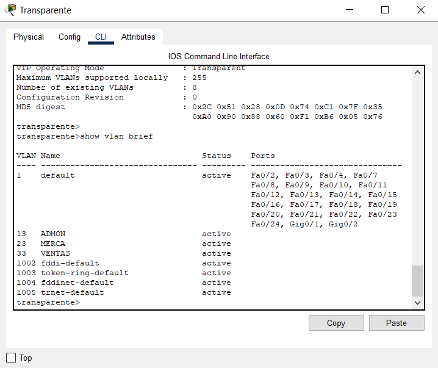

###### SWITCH CLIENTE01
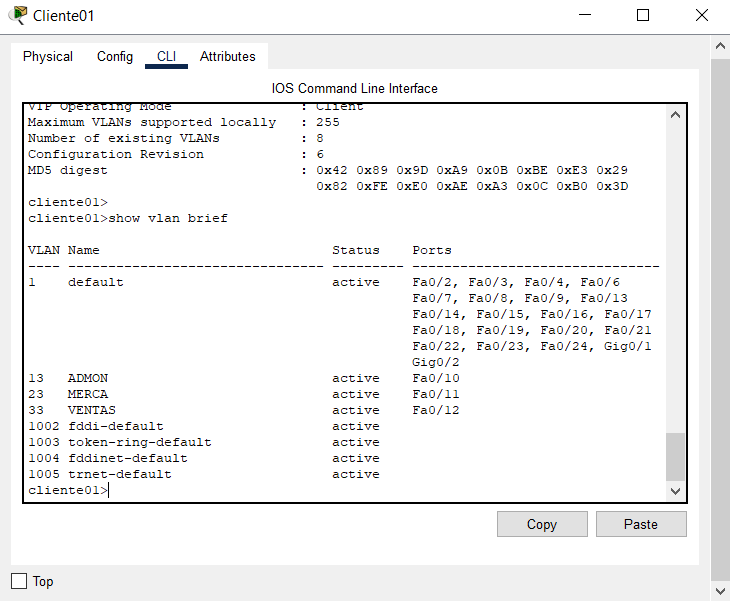

###### SWITCH CLIENTE02
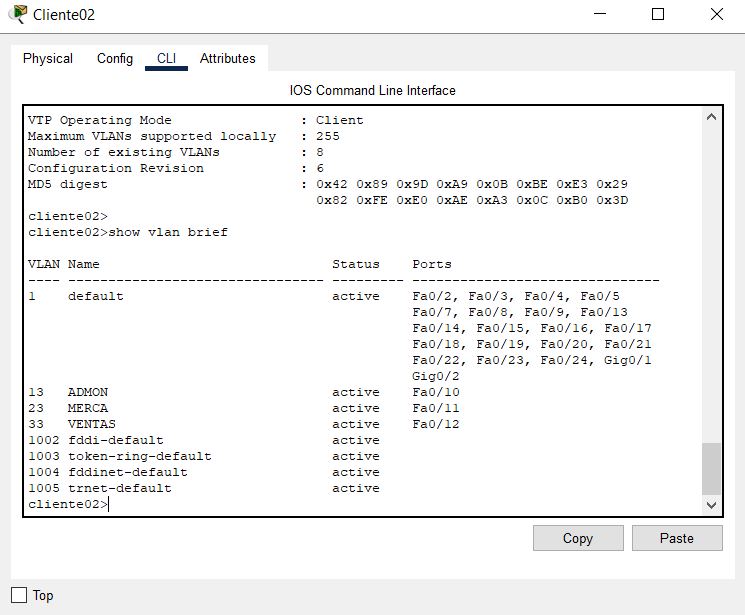

### PING ENTRE HOSTS

###### MISMA VLAN

Ping entre equipos de vlan "ADMON" y "ADMON":

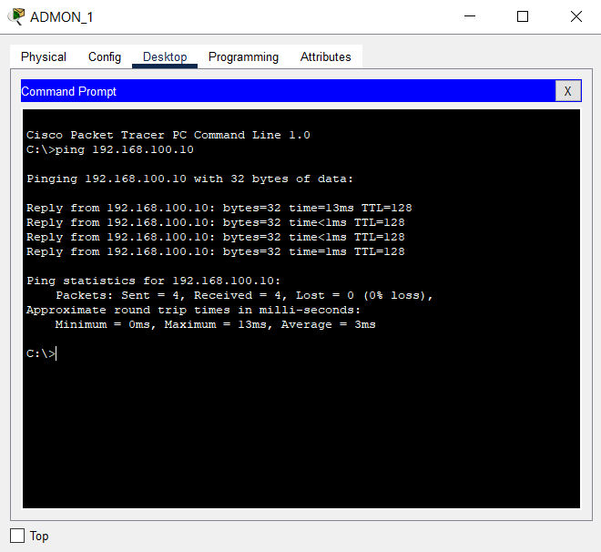

Ping entre equipos de vlan "MERCA" y "MERCA":

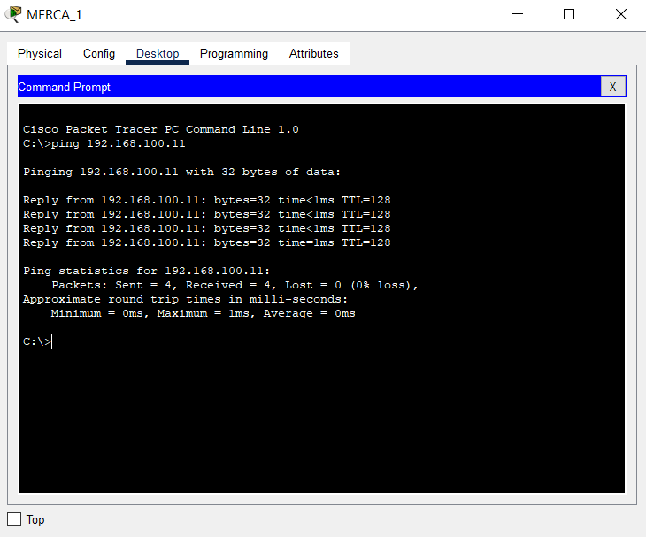

Ping entre equipos de vlan "VENTAS" y "VENTAS":

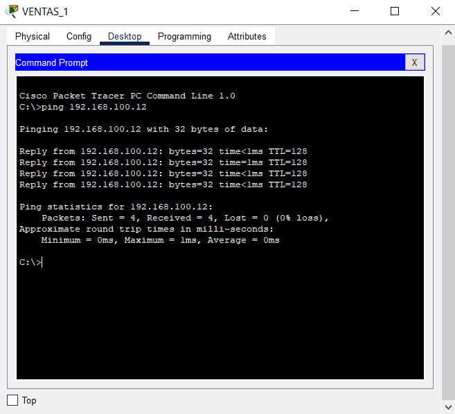

###### DISTINTA VLAN

Ping entre equipos de vlan "ADMON" y "MERCA":

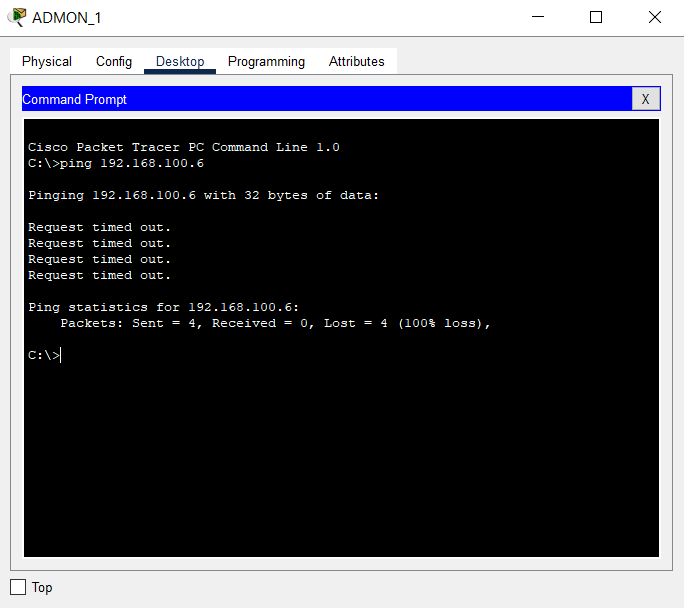

Ping entre equipos de vlan "MERCA" y "VENTAS":

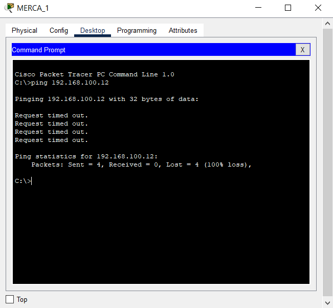

Ping entre equipos de vlan "VENTAS" y "ADMON":

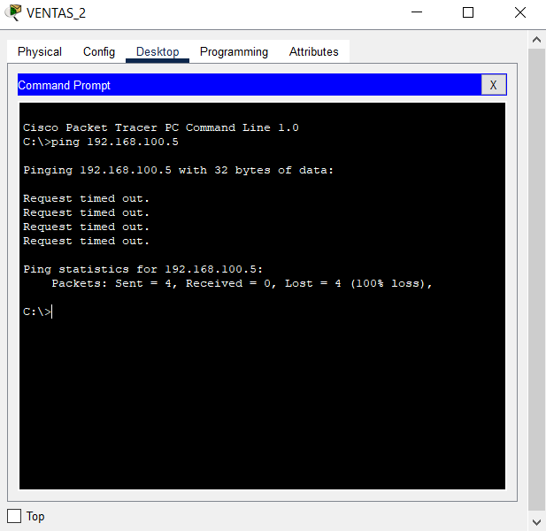