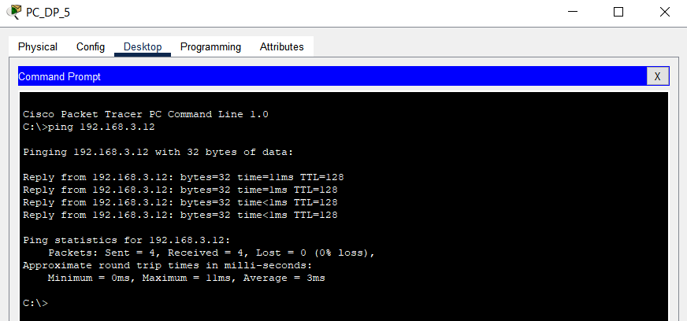

# MANUAL TÉCNICO
## Laboratorio de Redes de Computadoras 1
### Sección A

| DISPOSITIVO | IP | DEPARTAMENTO |
| :------: | :----------: | :-------------------------- |
| AG_AD_1  | 192.168.3.10 | Alta Dirección              |
| AG_AD_2  | 192.168.3.11 | Alta Dirección              |
| AG_AD_3  | 192.168.3.12 | Alta Dirección              |
| AG_AD_4  | 192.168.3.13 | Alta Dirección              |
| AG_RM_1  | 192.168.3.14 | Renderizado y Modelado 3D   |
| AG_RM_2  | 192.168.3.15 | Renderizado y Modelado 3D   |
| AG_RM_3  | 192.168.3.16 | Renderizado y Modelado 3D   |
| AG_RM_4  | 192.168.3.17 | Renderizado y Modelado 3D   |
| AG_RM_5  | 192.168.3.18 | Renderizado y Modelado 3D   |
| AG_RM_6  | 192.168.3.19 | Renderizado y Modelado 3D   |
| AG_RA_1  | 192.168.3.20 | Recepción y Administración  |
| AG_RA_2  | 192.168.3.21 | Recepción y Administración  |
| AG_RA_3  | 192.168.3.22 | Recepción y Administración  |
| AG_RA_4  | 192.168.3.23 | Recepción y Administración  |
| PC_AU_1  | 192.168.3.24 | Arquitectura y Urbanismo    |
| PC_AU_2  | 192.168.3.25 | Arquitectura y Urbanismo    |
| PC_AU_3  | 192.168.3.26 | Arquitectura y Urbanismo    |
| PC_AU_4  | 192.168.3.27 | Arquitectura y Urbanismo    |
| PC_AU_5  | 192.168.3.28 | Arquitectura y Urbanismo    |
| PC_AU_6  | 192.168.3.29 | Arquitectura y Urbanismo    |
| PC_AU_7  | 192.168.3.30 | Arquitectura y Urbanismo    |
| PC_AU_8  | 192.168.3.31 | Arquitectura y Urbanismo    |
| PC_AU_9  | 192.168.3.32 | Arquitectura y Urbanismo    |
| PC_AU_10 | 192.168.3.33 | Arquitectura y Urbanismo    |
| PC_DP_1  | 192.168.3.34 | Diseño Gráfico y Publicidad |
| PC_DP_2  | 192.168.3.35 | Diseño Gráfico y Publicidad |
| PC_DP_3  | 192.168.3.36 | Diseño Gráfico y Publicidad |
| PC_DP_4  | 192.168.3.37 | Diseño Gráfico y Publicidad |
| PC_DP_5  | 192.168.3.38 | Diseño Gráfico y Publicidad |
| PC_DP_6  | 192.168.3.39 | Diseño Gráfico y Publicidad |

# Comandos utilizados para configurar los switches
enable
configure terminal
hostname NuevoNombreSwitch
enable secret NuevoContraseñaSwitch
write memory
exit

# Capturas de la configuración de las VPCs

# Capturas de pantalla de pings entre hosts

# Capturas de pantalla de la demostración de la captura de un paquete ARP

# Capturas de pantalla de la demostración de la captura de un paquete ICMP

